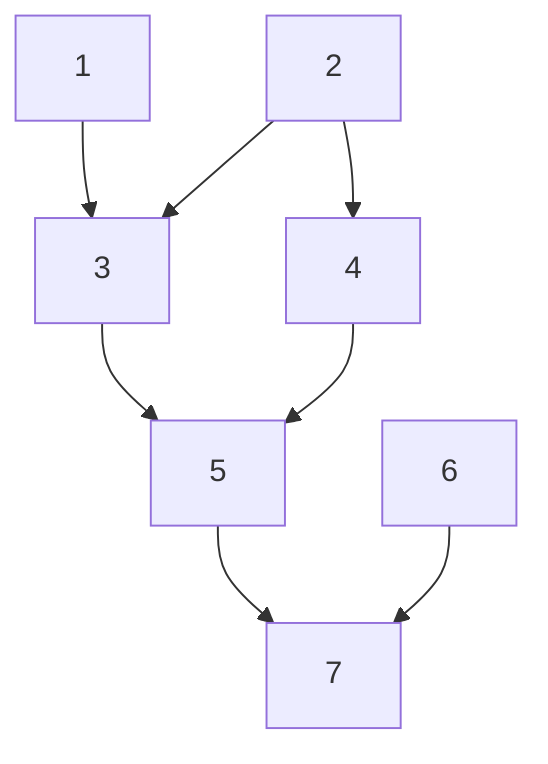

# pedMermaid

<!-- badges: start -->

[](https://github.com/nilforooshan/pedMermaid/actions/workflows/R-CMD-check.yaml)
[](https://cran.r-project.org/package=pedMermaid)
[](https://cran.r-project.org/package=pedMermaid)
[](https://github.com/nilforooshan/pedMermaid)
[](https://github.com/nilforooshan/pedMermaid/blob/master/LICENSE.md)
[](https://github.com/nilforooshan/pedMermaid/graphs/contributors/)

<!-- badges: end -->

R package pedMermaid generates [Mermaid](https://mermaid.js.org/) syntax for creating a pedigree flowchart in [Markdown](https://www.markdownguide.org/) and [R Markdown](https://rmarkdown.rstudio.com/), from a pedigree data frame.

## Installation

You can install the development version of pedMermaid like so:

```r
devtools::install_github('nilforooshan/ggroups')
```

## Example

This is a basic example of a pedigree flowchart created by the Mermaid syntax generated by the R package pedMermaid.

```r
library(pedMermaid)
ped <- data.frame(ID = 1:7,
                  SIRE = c(0, 0, 1, 0, 3, 0, 5),
                  DAM = c(0, 0, 2, 2, 4, 0, 6))
x <- mermaid_md(ped)
# cat(x, sep = "\n") # Display the output syntax on-screen
```



R package pedMermaid is equipped with functions `mermaid_md` and `mermaid_rmd` for generating Mermaid flowchart syntax for Markdown and R Markdown, respectively.
The syntax generated by `mermaid_rmd` is also applicable to Markdown.
However, the syntax is more restricted (less customizations) and less compact.
The `mermaid_md` function provides the following customizations:

- Links
  - Orientation (top-to-bottom or left-to-right)
  - Type (arrow or line)
  - Curve (not supported by `mermaid_rmd`)
  - Dash (dashed or solid) (not supported by `mermaid_rmd`)
  - Line width (not supported by `mermaid_rmd`)
  - Color (not supported by `mermaid_rmd`)
- Nodes (node-specific)
  - Text color (not supported by `mermaid_rmd`)
  - Background color
  - Border color
  - Round border
  - Dashed (or solid) border
  - Line width of the border
