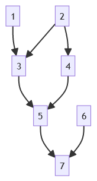
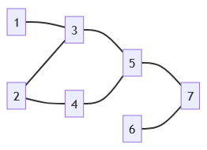
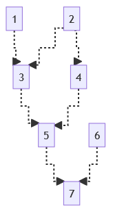

```{r, include = FALSE}
knitr::opts_chunk$set(
  collapse = TRUE,
  comment = "#>"
)
```

```{r setup}
library(pedMermaid)
```

[Markdown](https://www.markdownguide.org/) is a popular lightweight markup language that allows users to write formatted text using plain text.
It is widely used for writing web content, blogging, documentation, reporting, and presentation.
It is supported on popular platforms such as [GitHub](https://github.com/), and popular file formats such as [R Markdown](https://rmarkdown.rstudio.com/), where Markdown text, R code and outputs are collated.

[Mermaid](https://mermaid.js.org/) syntax is a Markdown-inspired text definition for creating dynamic and reproducible diagrams and charts.
It can be viewed in Mermaid editors or embedded and rendered in a Markdown or R Markdown document.
R package pedMermaid generates Mermaid syntax for creating a pedigree flowchart in Markdown and R Markdown, from a pedigree data frame.

R package pedMermaid is equipped with functions `mermaid_md` and `mermaid_rmd` for generating Mermaid flowchart syntax for Markdown and R Markdown, respectively.
The syntax generated by `mermaid_rmd` is also applicable to Markdown.
However, the syntax is more restricted (less customizations) and less compact.

## Customizations

The `mermaid_md` function provides the following customizations:

- Links
  - Orientation (top-to-bottom or left-to-right)
  - Type (arrow or line)
  - Curve
  - Dash (dashed or solid)
  - Line width
  - Color
- Nodes (node-specific)
  - Text color
  - Background color
  - Border color
  - Round border
  - Dashed (or solid) border
  - Line width of the border

Currently, the following customizations are not supported by `mermaid_rmd`.

- Links
  - Curve
  - Dash (dashed or solid)
  - Line width
  - Color
- Nodes (node-specific)
  - Text color

Node-specific customizations are defined by additional columns in the pedigree data frame,
and the link customizations are defined via function arguments.

## Examples

The pedigree data frame has three mandatory columns (ID, SIRE, and DAM), and optional columns
(TextColor, BgColor, BorderColor, RoundBorder, DashBorder, and lwd).
The order of columns does not matter, but column names do matter and case-sensitive.

### Example 1

Let's generate pedigree flowcharts for a pedigree data frame with only the mandatory columns.

```{r}
ped <- ped <- data.frame(
  ID = 1:7,
  SIRE = c(0, 0, 1, 0, 3, 0, 5),
  DAM = c(0, 0, 2, 2, 4, 0, 6)
)

x <- mermaid_md(ped)
cat(x, sep = "\n") # Display the output syntax on-screen.
# Do one of the following to write the output syntax into a file.
# cat(x, sep = "\n", file = "output.txt")
# write(x, file = "output.txt")
```



R package `DiagrammeR` is required to illustrate Mermaid diagrams on R Markdown documents.

```{r}
x <- mermaid_rmd(ped)
cat(x, sep = "\n")
library(DiagrammeR)
```

```{r, echo=FALSE}
mermaid("
graph TB
    1 --> 3
    2 --> 3
    2 --> 4
    3 --> 5
    4 --> 5
    5 --> 7
    6 --> 7
")
```

<ins>From hereon, only the pedigree flowchart is shown, not the syntax.</ins>

### Example 2

Let's repeat Example 1, changing arrow links to lines and the orientation to horizontal.

```{r}
x <- mermaid_md(ped, orient = "LR", type = "line")
```



```{r}
x <- mermaid_rmd(ped, orient = "LR", type = "line")
```

```{r, echo=FALSE}
mermaid("
graph LR
    1 --- 3
    2 --- 3
    2 --- 4
    3 --- 5
    4 --- 5
    5 --- 7
    6 --- 7
")
```

### Example 3

Let's repeat example 1 for `mermaid_md`, changing link curve to `"step"` and dashed.

```{r}
x <- mermaid_md(ped, curve = "step", dash = "Y")
```



### Example 4

Let's repeat example 1 for `mermaid_rmd`, showing females (2, 4, 6) with pink background and round border edges.

```{r}
ped$BgColor <- c(NA, "pink", NA, "pink", NA, "pink", NA)
ped$RoundBorder <- c(NA, "Y", NA, "Y", NA, "Y", NA)
x <- mermaid_rmd(ped)
```

```{r, echo=FALSE}
mermaid("
graph TB
    2(2)
    1 --> 3
    2 --> 3
    2 --> 4(4)
    3 --> 5
    4 --> 5
    6(6)
    5 --> 7
    6 --> 7
    style 2 fill:pink
    style 4 fill:pink
    style 6 fill:pink
")
```

Note that one could use hex color codes rather than color names.
Using the default value and `NA` are equivalent.
For example, using `"N"` (default value) and `NA` in the RoundBorder column, results in the same output.

### Example 5

Let's repeat Example 4, denoting individuals in the control group (2, 5, 7) with a ticker border line.

```{r}
ped$lwd <- c(NA, 3, 1, 1, 3, 1, 3) # NA & 1 are equivalent.
x <- mermaid_rmd(ped)
```

```{r, echo=FALSE}
mermaid("
graph TB
    2(2)
    1 --> 3
    2 --> 3
    2 --> 4(4)
    3 --> 5
    4 --> 5
    6(6)
    5 --> 7
    6 --> 7
    style 2 fill:pink,stroke-width:3
    style 4 fill:pink
    style 5 stroke-width:3
    style 6 fill:pink
    style 7 stroke-width:3
")
```
